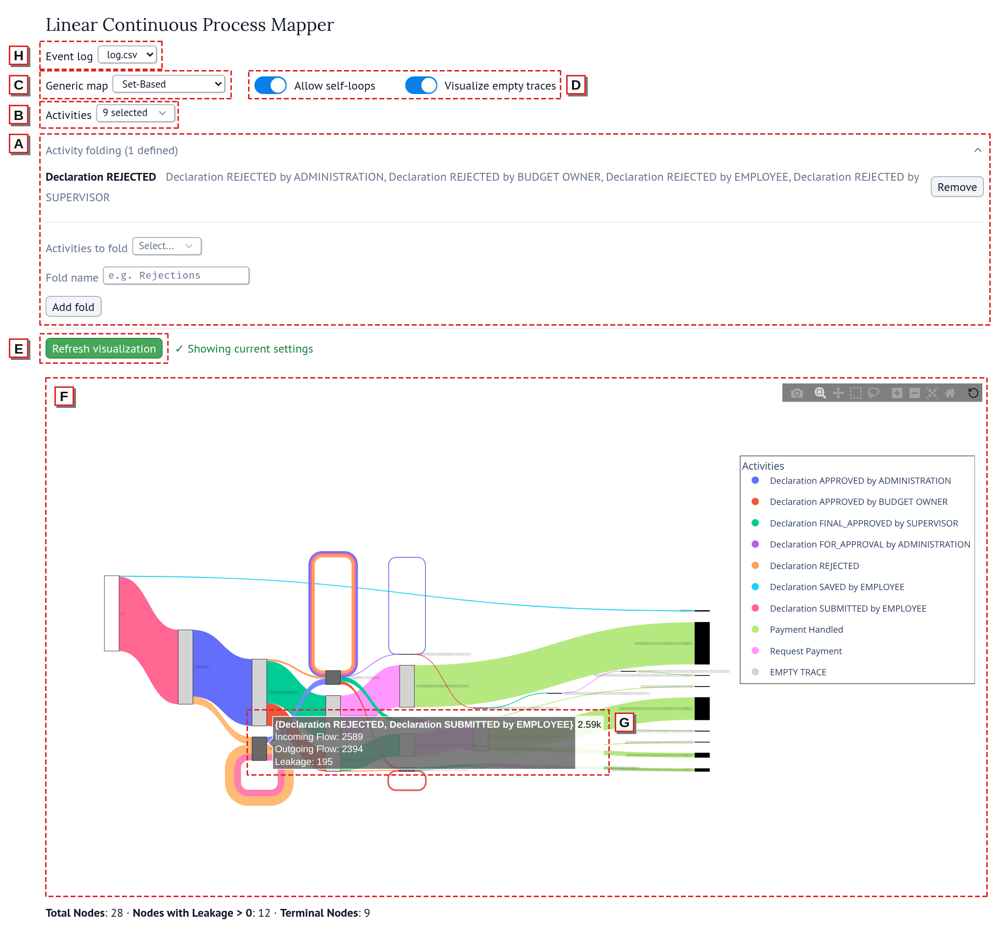

# LCM Marimo

# Linear Continuous Process Mapper

A prototypical implementation of linear and continuous process maps for the exploratory analysis of sequential behavior in event logs. This Python application builds upon interactive Sankey diagrams to provide effective visualizations of process behavior. The system loads event logs, constructs process maps using different abstractions (such as sequence-based, set-based, and last-activity-based), and visualizes them to display relevant insights in a precise yet interpretable way.

## Overview

UI of the application. Users choose an event log from the `logs/` folder via the event log selector (H), and can either analyze it as-is or apply further transformations by editing the marimo notebook. The UI supports folding activities (A) and activity selection (B). Furthermore, users can select from the three generic LCMs: sequence-, set-, or last-activity abstraction (C) and choose whether to visualize self-loops and empty traces (D). After selecting the desired visualization controls, they can refresh the visualization (E), which refreshes the Sankey diagram (F). Here, they can freely reposition nodes to adjust the visualization to their needs. More details about edges and nodes are revealed on hover (G).

## How to Run

This is the marimo version of the LCPM.

To get started:

```
uv sync
``` 

Then to run:
```
uv run marimo run marimo_app.py
```

Or to edit;
```
uv run marimo edit marimo_app.py
```

### Event logs

Put event logs in the `logs/` folder and choose one from the **Event log** dropdown at the top of the app. Both `.xes` and `.csv` files are supported. A CSV needs these columns:

- `case:concept:name`: case ID
- `concept:name`: activity
- `time:timestamp`: timestamp

The included `logs/log.csv` is a preprocessed version of DomesticDeclarations2H.xes, converted from XES to CSV with only the case, activity, and timestamp columns kept.

## Project Structure


**marimo_app.py** - The main entry point for running the application, via a marimo notebook.

**app** - Application factory and dependency injection layer. Contains the main logic that wires together all
components (data processors, graph builders, analyzers) to create the complete process analytics service.

**core** - Core business logic containing the main analytical components:

- **data** - Event log data handling using PM4Py. Loads XES files, processes event logs, filters by activities, and
  creates case-level variants for analysis
- **domain** - Graph analysis algorithms that enrich process graphs with business metrics including flow analysis,
  leakage detection, termination ratios, and node balancing
- **graph_builders** - Multiple strategies for constructing process graphs from event data: set-based prefix graphs,
  sequence-based prefix trees, and last-activity-based graphs with configurable loop handling
- **services** - High-level orchestration services that coordinate graph construction, simplification, and the complete
  analytics pipeline from raw data to visualizations
- **visualization** - Interactive Sankey diagram generator using Plotly that converts enriched process graphs into
  color-coded flow visualizations with hover details and activity legends

## Repository Authors
- [@moritzfaes](https://github.com/moritzfaes)
- [@hvoelzer](https://github.com/hvoelzer)
- [@aaronkurz](https://github.com/aaronkurz)
